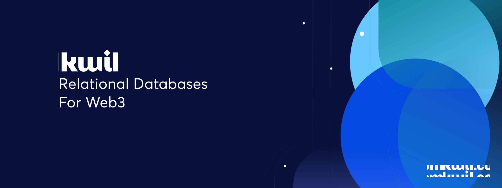

## Web3 Native Decentralized Database Networks

Kwil is a framework for leveraging relational databases as standalone, byzantine fault tolerant networks. Kwil extends the functionality of traditional relational databases by providing a practical Byzantine Fault Tolerant (pBFT) layer on top of existing engines, enforcing rules necessary for building secure, decentralized data stores.

Each Kwil network runs its own permissionless Proof-of-Stake (PoS) or permissioned Proof-of-Authority (PoA) blockchain, enabling projects to have a high-degree of configurability over their networks. With Kwil, applications and products can determine how, where, and by whom nodes are run in their blockchain

**Have a question? Join our [Discord](<https://discord.com/invite/HzRPZ59Kay>)!**

Kwil combines the structure and utility of a traditional transactional database with the guarantees of blockchain networks.  Broadly speaking, users can think of Kwil networks as a relational database with the following features:

- Secure, permissionless, deterministic relational data storage and retrieval across of a network of nodes.
- Integrates natively with other Web3 platforms, concepts, and tooling.
- Supports a variety of access control rules, network configurations, and value accrual mechanisms.

### Data Replication

Kwil network data is replicated across a sufficient number of nodes to guarantee that at any point in time, there is an accurate and available copy of a database's active state.  Not only does this ensure uptime and resilience, but it also enables users of applications built on top of Kwil to relax their trust assumptions for an application, in favor of the trust guarantees provided by a distributed ledger.

### Access Control

The Kwil network offers a unique method of writer access-control for applications.  While it is common for user authentication to be part of the application layer in the centralized stack, Kwil provides a suite of tools to enable developers to bake access-control directly into their application's data.  By making access configurable at the protocol level, Kwil solves for many of the security and privacy concerns plaguing typical distributed storage networks.

### Embedding Value In Data

Smart contract platforms enable developers to code with programmable money.  In a Kwil database, developers are able to atomically capture the value of data to assets that exist on other blockchains.  By combining tokens with valuable data, builders are able to create new business models, value capture mechanisms, and user incentives that couldn't exist previously.

### Consensus

The Kwil network uses CometBFT, the underlying consensus engine of the Cosmos SDK, for Practical Byzantine Fault Tolerant (pBFT) consensus. CometBFT is the most mature BFT consensus engine in existence. For more information, check out the [CometBFT docs](https://docs.cometbft.com/v0.37/)
