### Kuneiform DML

<iframe
  width="100%"
  height="800"
  src="https://kwilteam.github.io/sql-grammar/"
></iframe>

<!-- ### statements

### sql_stmt_list

referenced by: [statements](#statements)

### sql_stmt

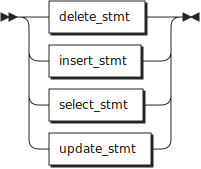

referenced by: [sql_stmt_list](#sql_stmt_list)

### indexed_column

referenced by: [upsert_clause](#upsert_clause)

### cte_table_name

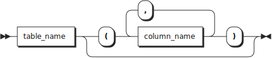

referenced by: [common_table_expression](#common_table_expression)

### common_table_expression

referenced by: [common_table_stmt](#common_table_stmt)

### common_table_stmt

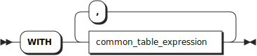

referenced by: [delete_stmt](#delete_stmt), [insert_stmt](#insert_stmt), [select_stmt](#select_stmt), [update_stmt](#update_stmt)

### delete_stmt

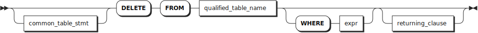

referenced by: [sql_stmt](#sql_stmt)

### variable

referenced by: [expr](#expr)

### function_call

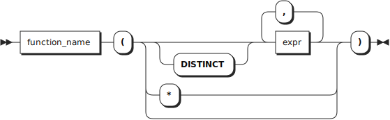

referenced by: [expr](#expr)

### column_ref

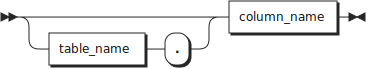

referenced by: [expr](#expr)

### when_clause

referenced by: [expr](#expr)

### expr

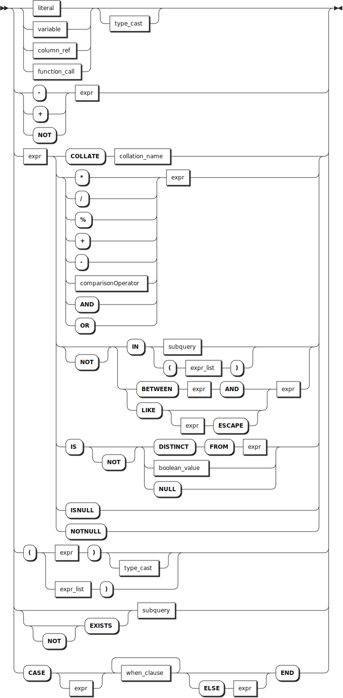

referenced by: [delete_stmt](#delete_stmt), [expr](#expr), [expr_list](#expr_list), [function_call](#function_call), [join_constraint](#join_constraint), [limit_stmt](#limit_stmt), [ordering_term](#ordering_term), [result_column](#result_column), [returning_clause_result_column](#returning_clause_result_column), [select_core](#select_core), [update_set_subclause](#update_set_subclause), [update_stmt](#update_stmt), [upsert_clause](#upsert_clause), [upsert_update](#upsert_update), [value_row](#value_row), [when_clause](#when_clause)

### subquery

referenced by: [expr](#expr)

### expr_list

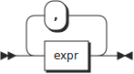

referenced by: [expr](#expr)

### comparison_operator

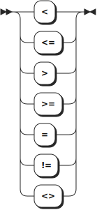

referenced by: [expr](#expr)

### cast_type

referenced by: [type_cast](#type_cast)

### type_cast

referenced by: [expr](#expr)

### boolean_value

referenced by: [expr](#expr), [literal](#literal)

### string_value

referenced by: [literal](#literal)

### numeric_value

referenced by: [literal](#literal)

### literal

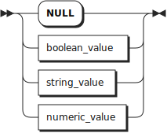

referenced by: [expr](#expr)

### value_row

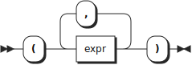

referenced by: [values_clause](#values_clause)

### values_clause

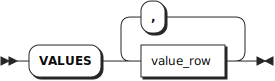

referenced by: [insert_stmt](#insert_stmt)

### insert_stmt

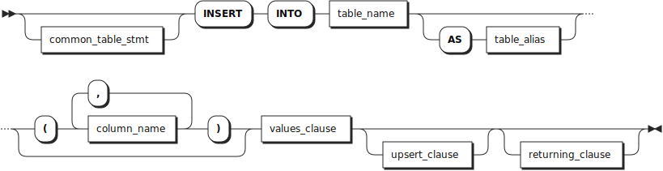

referenced by: [sql_stmt](#sql_stmt)

### returning_clause

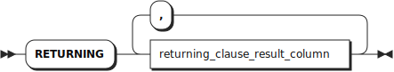

referenced by: [delete_stmt](#delete_stmt), [insert_stmt](#insert_stmt), [update_stmt](#update_stmt)

### upsert_update

referenced by: [upsert_clause](#upsert_clause)

### upsert_clause

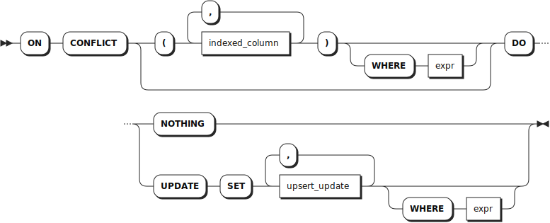

referenced by: [insert_stmt](#insert_stmt)

### select_stmt_core

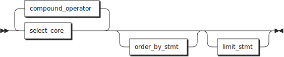

referenced by: [common_table_expression](#common_table_expression), [select_stmt](#select_stmt), [subquery](#subquery), [table_or_subquery](#table_or_subquery)

### select_stmt

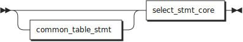

referenced by: [sql_stmt](#sql_stmt)

### join_clause

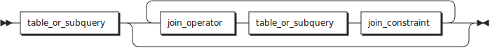

referenced by: [select_core](#select_core), [update_stmt](#update_stmt)

### select_core

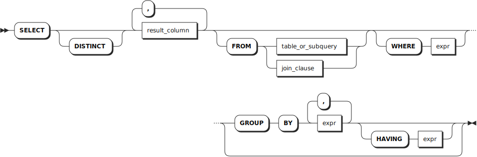

referenced by: [select_stmt_core](#select_stmt_core)

### table_or_subquery

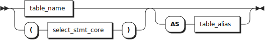

referenced by: [join_clause](#join_clause), [select_core](#select_core), [update_stmt](#update_stmt)

### result_column

referenced by: [select_core](#select_core)

### returning_clause_result_column

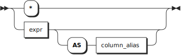

referenced by: [returning_clause](#returning_clause) 

### join_operator

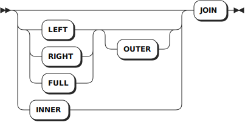

referenced by: [join_clause](#join_clause)

### join_constraint

referenced by: [join_clause](#join_clause)

### compound_operator

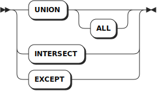

referenced by: [select_stmt_core](#select_stmt_core)

### update_set_subclause

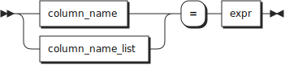

referenced by: [update_stmt](#update_stmt)

### update_stmt

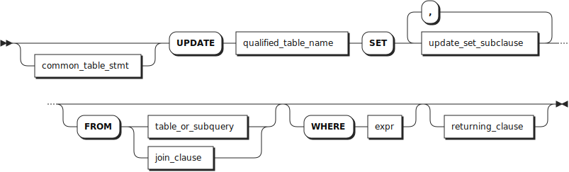

referenced by: [sql_stmt](#sql_stmt)

### column_name_list

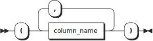

referenced by: [update_set_subclause](#update_set_subclause), [upsert_update](#upsert_update)

### qualified_table_name

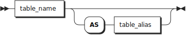

referenced by: [delete_stmt](#delete_stmt), [update_stmt](#update_stmt)

### order_by_stmt

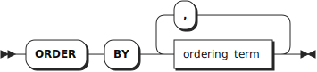

referenced by: [select_stmt_core](#select_stmt_core)

### limit_stmt

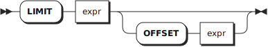

referenced by: [select_stmt_core](#select_stmt_core)

### ordering_term

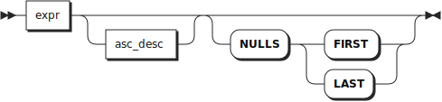

referenced by: [order_by_stmt](#order_by_stmt)

### asc_desc

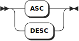

referenced by: [ordering_term](#ordering_term)

### function_keyword

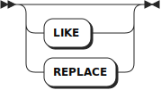

referenced by: [function_name](#function_name)

### function_name

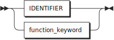

referenced by: [function_call](#function_call)

### table_name

referenced by: [column_ref](#column_ref), [cte_table_name](#cte_table_name), [insert_stmt](#insert_stmt), [qualified_table_name](#qualified_table_name), [result_column](#result_column), [table_or_subquery](#table_or_subquery)

### table_alias

referenced by: [insert_stmt](#insert_stmt), [qualified_table_name](#qualified_table_name), [table_or_subquery](#table_or_subquery)

### column_name

referenced by: [column_name_list](#column_name_list), [column_ref](#column_ref), [cte_table_name](#cte_table_name), [indexed_column](#indexed_column), [insert_stmt](#insert_stmt), [update_set_subclause](#update_set_subclause), [upsert_update](#upsert_update)

### column_alias

referenced by: [result_column](#result_column), [returning_clause_result_column](#returning_clause_result_column)

### collation_name

referenced by: [expr](#expr)

### index_name

### EOF

referenced by: [statements](#statements) -->