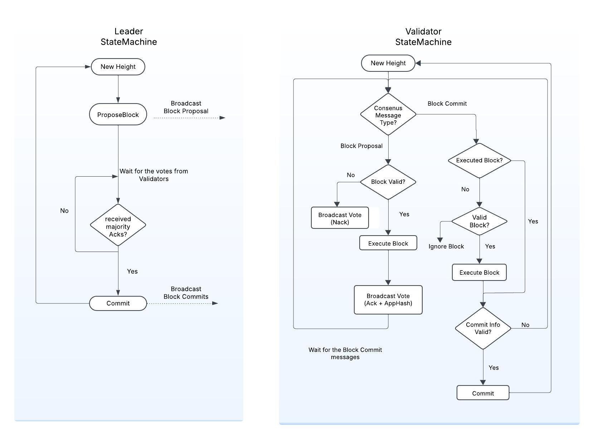

This page provides an overview of the Roadrunner consensus algorithm and the state trasitions on all the nodes of the Kwil network.

## Overview

Each node in the Kwil network assumes one of the following roles:
1. **Leader**: Responsible for proposing and finalizing new blocks.
2. **Validator**: Engages in the consensus process by voting on proposed blocks and validating state changes.
3. **Sentry**: Not involved in the consensus process, these nodes handle front-end tasks such as processing JSON-RPC requests and disseminating blocks and transactions across the network.

The network begins with an initial leader and validators, who engage in the consensus process to reach agreement on blocks and state changes.

## Consensus

Each consensus round in the Roadrunner consensus algorithm consists of 2 main phases, the Propose Phase to reach consensus on the block and the Commit Phase to commit the block and update the state on the nodes. The Blocks are committed in a chain and the state changes are applied to the database. 

### Propose Phase
Propose phase is where the leader proposes a new block and the network comes to consensus on the block and the state changes made by the block. The propose phase consists of the following steps:

1. The leader at the start of the round:
    - Propose a new block, signs the block and broadcasts the [block proposal](#blockproposal) to the network.
    - Waits for the validators to vote on the block.
2. Validators upon receiving the [block proposal](#blockproposal) does the following:
    - Verify that the block proposal is from the leader and is for the next block height, else ignore the block proposal.
    - Validate the block and if the block is not valid, broadcast a [Nack Vote](#vote).
    - If the block is valid, execute the block and broadcast an [Ack Vote](#vote) with the AppHash (Application state hash).
3. The leader upon receiving a vote, verifies that the vote is from a validator from the validator set by verifying the signature and accepts it if valid.
4. If a majority of validators vote ACK and reach the same application state hash, leader proceeds to the [commit phase](#commit-phase).
5. If at least half of the validators diverge from the state or responded with a NACK, leader `halts` the network.

### Commit Phase

Leader having confirmed that the majority of validators agree on the block and its state changes in the [Propose Phase](#propose-phase), proceeds to commit the block.

Leader:
- Leader commits the block to the block store and applies the state changes to the Postgres database.
- Leader broadcasts the [block commit](#blockann) messages to the network containing commit information such as the `app hash`, `signed validator votes` etc.
-  Leader proceeds to the next round.

Validators upon receiving the committed block:
- [Validate CommitInfo](#block-commit-verification) and if the commit info is invalid, ignore the block commit.
- If the commit info is valid, but the node has a different application state hash, the node will be halted.
- If the commit info is valid and the node has the same application state hash, the node commits the block to the block store and applies the state changes to the database and proceeds to the next round.

## Consensus Messages

Below are the detailed info on what is being exchanged between the nodes to facilitates the consensus process during a consensus round or that triggers state transitions on different nodes of the Kwil network. All these consensus messages are cryptographically signed by the sender to ensure authenticity and integrity.

### BlockProposal
Block proposal messages are issued and signed by the leaders indicating that a new block has been proposed. The block proposal contains the new block, block id and the signature of the leader.
Block proposals are to be consumed by the validators. Validators only accept the block proposal if it matches the next block height and the block is valid

### BlockAnn
Block announcements are issued by the leader after the block has been committed. The block announcement contains the committed block, block id and the signed validator votes for the block.
Block announcements are to be consumed by the validators and sentry nodes to commit the block and move to the next round.

### Votes
Validators participates in the consensus round by submitting their vote indicating whether they agree or disagree with the block proposed by the leader.
Validators may reject a block for various reasons, such as disagreements with the validator set, network parameters, the merkle root of the transactions, or the application state hash.

A vote issued by a validator includes the following:
- `BlockID`: The BlockID corresponding to the block proposed by the leader.
- `Ack`: A Boolean value indicating whether the validator accepts (True) or rejects (False) the block.
- `AppHash`: This is optional and provided only if the validator is submitting an ACK. It represents the hash of the application state after applying the block.

Validators include their signatures with the vote allowing the leader and other validators to verify the vote's authenticity and integrity. The message signed by the Validators depends on whether they are issuing a NACK or ACK vote.
- NACK: `BlockID + NACK`
- ACK:  `BlockID + ACK + AppHash`

If a validator notices that the leader is proposing a block that has already been finalized, it will issue a NACK vote along with an OutOfSync proof. This proof contains the latest block header with the leader's signature for verification. The OutOfSync proof informs the leader that it is behind the latest block and needs to catch up with the block in the OutOfSync proof before proposing a new block.

The current consensus mechanism does not detect duplicate votes; however, only the first valid vote is taken into account, and any subsequent votes are disregarded. These votes are not persisted, so if leader is reset for some reason, the validators will continue to reannounce their votes, until the block commit announcement is received.

## Block Commit Verification

Upon receiving the block commit message, the nodes must validate the leader’s commit decision before applying the block changes to the database. The commit verification process ensures that the block is valid and that the majority of the validators have agreed on the block and the state changes made by the block.

Commit verification must confirm that the following conditions are satisfied:
1. Validator votes are valid:
    - Votes are cast by validators within the validator set.
    - Vote signatures are valid.
2. A majority (> 50%) of validators have voted ACK on the block and have achieved the same state as the leader.

Only if the above conditions are met, the validator should commit the block and update the state.

## Creating Block Proposal
Two main configurations influence how quickly the leader can create a block proposal:
1. `consensus.propose_timeout`: This is the minimum duration the leader waits before proposing a block with transactions. This ensures the leader has sufficient time for mempool to have transactions and create a block proposal, while also allowing the slow validators time to catch up. The leader will only propose a block at the end of this timeout if there is at least one transaction in the mempool. However, if the mempool has enough transactions to fill the block size at anypoint during this propose_timeout duration, the leader will bypass this timeout and propose a block immediately.

2. `consensus.empty_block_timeout`: This is the duration the leader waits before proposing an empty block. If set to 0, the leader will not propose empty blocks and will wait for transactions to appear in the mempool. If set to a non-zero value, the leader will propose an empty block if the mempool remains empty and the timeout is reached. Set this to a value significantly greater than the `consensus.propose_timeout` to avoid proposing empty blocks too frequently and fill up the block store with empty blocks.
