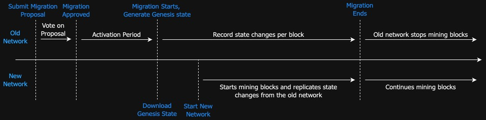

Zero-downtime migrations allow a new network to run in parallel with the existing one, ensuring data remains accessible through both networks during the migration. The new network continuously synchronizes state changes from the original network, keeping it up to date. Users and applications can seamlessly switch to the new network endpoints during the migration, with no disruption. Once migration is complete, the old network is safely decommissioned.

Kwil supports zero-downtime migrations from v0.9 onwards. Any Kwil networks running v0.9 or later can upgrade their network without any downtime using zero-downtime migrations. This document describes in detail the key phases involved in the zero-downtime migration process:
1. [Migration Proposal Phase:](#migration-proposal-phase) Validators propose and approve a migration plan, initiating the migration process.
2. [Activation Period: ](#activation-period) A migration is approved but not yet active. Validators prepare for the upcoming migration. No new migration proposals are allowed during this period.
3. [Migration Phase: ](#migration-phase) Once the activation period ends, the old network transitions into migration phase. New network becomes active once genesis state is available. State changes are continuously synchronized from the old network.
5. [Migration Ends: ](#migration-ends) The old network halts at the proposed height, and the new network continues to operate.



Refer to the [tutorial](/docs/node/migrations/zero-downtime-migrations/tutorial) for a step-by-step guide on how to upgrade your network using zero-downtime migrations.

## Migration Proposal Phase
A network migration is proposed by a validator using a special network governance resolution. A migration proposal has four key properties:

- `ActivationPeriod`: The amount of blocks before the migration is activated. It starts after the migration is approved via the voting system. The intention is to allow validators to prepare for the migration.
- `Duration`: The amount of blocks the migration will take to complete.
- `ChainID`: The new chain ID that the network will migrate to. A new chain ID should always be used for a new network to avoid cross-network replay attacks.
- `Timestamp`: The time at which the migration was proposed.

The Migration proposal needs to be approved by at least 2/3rd of the validators to start the migration process. The migration proposal will expire if the supermajority of the validators do not approve the proposal within `100800` blocks (roughly 7 days with a 6 second block interval). Once the migration proposal is approved, the network moves into migration mode after the specified activation period.

### Submit Migration Proposal

A validator operator can submit a migration proposal using the `kwil-admin migrate propose` command as shown below. Refer to the [submit migration proposal](/docs/ref/kwil-admin/migrate/propose) documentation for more details.

```bash
kwil-admin migrate propose --activation-period <activation_period> --duration <migration_duration> --chain-id <new_chain_id>
```

:::note
Off-chain communication is required among the validator operators to decide on the details of the migration proposal. One of the validators should submit the proposal to the network for approval. Only one proposal can be applied to the network during the lifetime of the network (per chain-id). Once the proposal is approved, all the other migration proposals will be rejected from the network and no new proposals can be submitted or approved.
:::

To check if the proposal is submitted successfully, we can get the list of pending migration proposals as shown below:

```bash
kwil-admin migration list
```
This list will contain the proposal ID which is used by the validators to vote on the proposal. If it's a single validator network, the proposal will be automatically approved and removed from this pending list.


### Approve Migration Proposal

To start the migration, the migration proposal needs the approval from at least a supermajority of the validators. The validators can submit their vote approval on the migration proposal using the below command.

```bash
kwil-admin migration approve <proposal_id>
```

Operators can check the status of the proposal and the votes information as shown below:

```bash
kwil-admin migration status <proposal_id>
```

:::note
The migration proposal will expire if the supermajority of the validators do not approve the proposal within `100800` blocks (roughly 7 days with a 6sec block interval). Validators can resubmit the proposal after expiration.
:::

## Activation Period

Once >2/3 of the validators approve the migration proposal, the migration will start after the activation period. During this activation period, the network will reject any new migration proposals. The activation period allows all network participants to prepare for the upcoming migration.

### Setting Up New Network

All the validator node operators should start setting up their nodes for the new network during the ActivationPeriod. All the validator operators should agree on the genesis configuration for the new network except the `app_hash`, `validators` and `migration` configurations. These configurations should be left empty as they will be filled in during the migration phase automatically by the new nodes when run in `migration` mode.

To enable validators in the new network to replicate changes from the old network, the new validators need to set the following configurations in the `config.toml`.
`migrate_from` config in the `config.toml` file specifies the JSON-RPC address of the node from the old network that the new network should replicate the state changes from.

```toml
[migration]
# Enable starts kwild in migration mode to replicate state changes from the old network.
enable = true

# The listening address of the node from the old network to replicate the state changes from.
# This is a mandatory field if migration is enabled.
migrate_from = "http://kwild-jsonrpc-server-address:8484"
```
Once the configuration is set, the new network validators can start their nodes in migration mode. In this mode, the validators will keep checking with the old network if the genesis state is available. Once the genesis state is available, these nodes will download the genesis state, update the configurations and start producing blocks.


## Migration Phase
The network migration begins once the activation period has elapsed since the approval of migration proposal. At the start of the migration, all the nodes on the old network generates a network snapshot and the genesis configuration required to initialize the new network. From this height onwards, all the nodes on the old network record state changes such as account spends or changes to user datasets on a per-block basis.

During migration, the old network will continue to operate but with limited capabilities. It will continue to support inserts/updates/deletes on user datasets. However, the following functionalities are disabled on the old network and will only execute on the new network:
- Schema Deploy and Drop
- Account Credits and Transfers
- Resolution Creation
- Resolution Approvals

The new network starts once the genesis state becomes available from the old network i.e. at the beginning of the migration phase, at which point nodes on the new network begin producing blocks. During this period, state changes from the old network are continually replicated onto the new network. Since both networks continue to process transactions, the new network detects and resolves state change conflicts that may be encountered. In general, the conflict resolution prefers the state on the new network. Refer the [Conflict Resolution](#conflict-resolution) section for more details.

:::note
Operators should migrate to new network as soon as possible and redirect all the user transactions to the new network.
:::

### Conflict Resolution

During the migration phase, the new network will receive state changes from the old network. These state changes include changes to user datasets and account spends. The new network will detect and resolve any conflicts that may arise while applying these state changes. The conflict resolution principles are designed to favor the state on the new network over the old network. Below are the conflict resolution principles for user datasets and account spends:

Conflict resolution principles for the user datasets:

- **Inserts**: The new network will check if the record already exists on the new network. The new network will apply the insert if the record does not exist on the new network. Otherwise, the insert will be ignored.
- **Updates**: The new network will check the pre-change value of the proposed update from the old network's changeset. If the new network's record for that primary key matches the pre-change value in the changeset, it will apply the change. If the values are not equal, it will discard the change in favor of what data exists on the new network
The new network will check if the record on the new network matches the old network’s record before the update. If they match, the update will be applied. If not, the update will be ignored in favor of the data on the new network.
- **Deletes**: Similar to update, if the record on the new network matches the deleted record, it will be deleted. Otherwise, no change will be applied.

Conflict resolution principles for account spends:

-  If a spend from the old network would cause a user's balance to drop below zero, the entire balance will be spent, setting it to zero, else the spend will be applied as is.

## Migration Ends

The old network halts after the `Duration` blocks since the start of the migration. The old network will no longer accept new transactions or produce new blocks with transactions. The RPC services remain available for querying the state of the network. Once the new network is fully synced with the old network, the old network can be safely decommissioned. The new network continues to process transactions and produce blocks as usual.