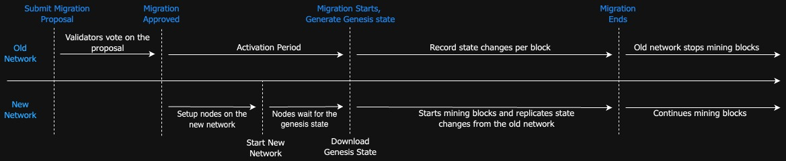

This page describes in detail the different phases the existing network goes through during a network migration process, from the approval of a migration proposal to the final decommissioning of the old network. 

The migration process consists of four major stages: 
- `NoActiveMigration`  :  No approved migrations on the network yet.
- `MigrationNotStarted`:  Migration is approved but not yet started. This phase is called the activation period.
- `MigrationInProgress`:  Migration is in progress.
- `MigrationCompleted` :  Migration completed and the current chain is halted.

## Activation Period
**MigrationStatus:** MigrationNotStarted

Once the migration proposal is approved, the migration is set to start after the activation period. During this activation period, no new migration proposals can be submitted or approved. The activation period allows all network participants to prepare for the upcoming migration.

## Start Height
**MigrationStatus:** MigrationInProgress

At the start of the migration, all the existing nodes will take a network snapshot and generate the genesis configuration files that will be used to initialize the new network. Starting from this height, all the nodes in the existing network records the state changes per block used to replicated state onto the new network.

Starting from this height, the existing network will continue to operate but with limited capabilities. It will continues to support "inserts/updates/deletes" on user datasets as usual but the below functionalities will be disabled during the migration period:
- Schema Deploy and Drop
- Account Credits and transfers
- Resolution creation
- Approving resolutions

## End Height
**MigrationStatus:** MigrationCompleted

The existing network halts at the end height. The network will no longer accept new transactions or produce new blocks with transactions. The RPC services remain available for querying the state of the network. Once the new network is fully synced with the existing network, the existing network can be safely decommissioned.
